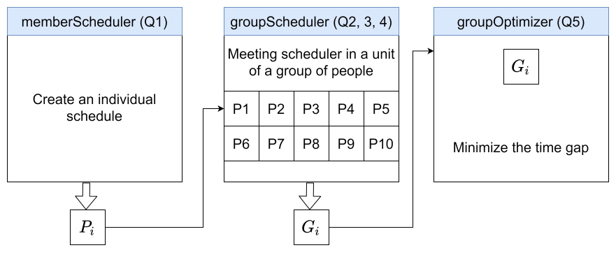

# 2022Fall_assignment4_template
made by TA Pohan Wang (2022 Fall)

1. The core idea in this assignemnt4 is to let the students be able to come up with an basic OOP framework, and practice a collobrative programming work through Git.

2. The grading script will be based whether or not the modules can be normally executed, and the README.md results generated from your code. (i.e. in this assignment, `pytest` file only provides the compiliability detection, the grading details will based on your the generated report.)

3. index_slot_map.csv can be used as a referral file for mapping slot number to the time format

## System Design

In our template framework, there are three module files named as `memberScheduler.py`, `groupScheduler.py`, and `scheduleOptimizer.py`, and a `test_assignment4.py`. Please complete the code works in the three modules, and use `test_assignment4.py` to test the funcationality. Detailed requirements of the inputs/outputs of each module is listed following



### memberScheduler.py (for Q1)

Please create a `personSchedule` class in memberScheduler.py whicn contains `view_schedule(self)`, `add_event()`, `del_event()` to print out the required format from the problem set. (All the other dependent private/public attributes/methods are desinged by students)

Our test script will be:

```python
instane_member_schedule = my_script1.personSchedule(**kwargs1)
instane_member_schedule.view_schedule()
```

where the kwargs input is `[{'name': 'Albert Kaplan', 'classes': {'Mon': 2, 'Tue': 3, 'Wed': 2, 'Thu': 3, 'Fri': 2}},
    {'name': 'Sherri Strickland', 'classes': {'Mon': 3, 'Tue': 2, 'Wed': 3, 'Thu': 2, 'Fri': 3}}]`

Class representation, Albert and Sherri are our the schedule instance of a person.

```mermaid
classDiagram
    memberScheduler <|-- Albert
    memberScheduler <|-- Sherri
    memberScheduler : +userdefined
    memberScheduler: -__init__(self, **kwargs)
    memberScheduler: +view_schedule(self)
    class Albert{
        +userdefined
        +view_schedule(self)
    }
    class Sherri{
        +userdefined
        +view_schedule(self)
    }
```

Bouns:
time_dict_input = {'time': {'from': '09:30', 'to': '10:30'}}
- add_event(self, time_dict_input)
- del_event(self, time_dict_input)

### groupScheduler.py (for Q2-4)

Please create a `groupScheduler` class in memberScheduler.py whicn contains `MeetingScheduler(self, **kwargs)` method to print out the required format or create an visulized readme.md file for the given meeting with this group. The instance of groupScheduler is consisted by multiple of `personSchedule` instances from the previous one. (All the other dependent private/public attributes/methods are desinged by students)

Our test script will be:

```python
for loop in member_create_list from input1:
        instane_member_schedule = my_script1.personSchedule(**kwargs1)

groupScheduler_instance = my_script2.groupScheduler(p_list)
groupScheduler_instance.MeetingScheduler(**input2)
```

where the 

kwargs input1 is 

`[{'name': 'Albert Kaplan', 'classes': {'Mon': 2, 'Tue': 3, 'Wed': 2, 'Thu': 3, 'Fri': 2}},
    {'name': 'Sherri Strickland', 'classes': {'Mon': 3, 'Tue': 2, 'Wed': 3, 'Thu': 2, 'Fri': 3}}]`

kwargs input2 is

`{"C++ Learning Group" : [60, ["Albert Kaplan", "Sherri Strickland"]],"NASA Project Team" : [60, ["Albert Kaplan", "Sherri Strickland"]] }`


Expected output:

A neat summarized results in `Q3report/README.md`


### scheduleOptimizer.py (for Q5)

Please create a `scheduleOptimizer` class in scheduleOptimizer.py whicn contains `MeetingScheduler()` method to print out the required format or create an visulized readme.md file from the problem set. The instance of scheduleOptimizer is consisted by a `groupScheduler` instances from the previous one. (All the other dependent private/public attributes/methods are desinged by students)

Our test script will be:

```python
for loop in member_create_list from input1:
        instane_member_schedule = my_script1.personSchedule(**kwargs1)

groupScheduler_instance = my_script2.groupScheduler(p_list)
scheduleOptimizer_instance = my_script3.scheduleOptimizer(groupScheduler_instance, main_schedule)
groupScheduler_instance.MeetingScheduler(**meeting_input)
```

where the 

main_schedule is 

`{'Mon': [1, 0, 0, 0, 0, 0, 1, 1, 0, 1, 1, 0, 0, 0, 0, 0],
    'Tue': [1, 0, 0, 0, 1, 1, 1, 0, 0, 1, 1, 1, 1, 1, 1, 0],
    'Wed': [0, 0, 0, 0, 1, 1, 0, 0, 0, 0, 0, 0, 1, 0, 1, 1],
    'Thu': [1, 1, 1, 1, 1, 1, 1, 1, 1, 0, 0, 0, 0, 0, 0, 1],
    'Fri': [0, 0, 0, 1, 1, 1, 1, 0, 0, 0, 0, 0, 0, 0, 0, 0]}}`

kwargs input2 is

`{"ME396 Project discussion with G1" : [60, ["Albert Kaplan", "Sherri Strickland", "Linda Ruiz", "Jen Madden", "Katherine Medina", "Deb Shah", "Hope Glover", "Ruben Forbes", "Alice Parsons", "Ira McGuire", "Viola Caldwell", "Annie Gilbert", "Laurie Carroll", "Kristin Holder", "Lindsay Munoz", "Terrance Bates"]],
    "ME396 Project discussion with G2" : [60, ["Inez Barrett", "Katie Gaines", "Herbert Woodard", "Rochelle Boone", "Sabrina Hart", "Yvonne Glass", "Al Clements", "Shelia Porter", "Wendell Kelly"]],
    "ME396 Project discussion with G3" : [60, ["Jan Serrano", "Sherri Strickland", "Debbie Trujillo", "Lydia May", "Wendell Kelly", "Herbert Woodard", "Katie Gaines"]]}`


Expected output:

A neat summarized results in `Q5report/README.md`